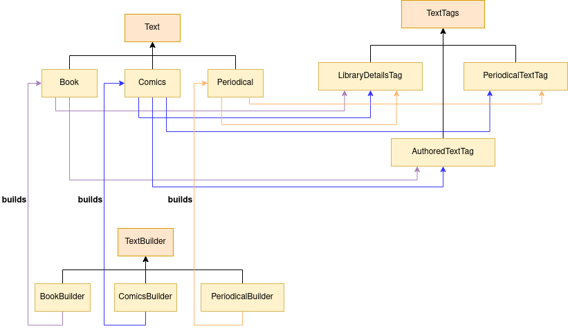

# libhw2

### Describtion

`libhw2` implements a `Library` which stores different forms of `Text`s. There
are two separate hierarchies related to them - one that has the texts and one
that is responsible for their construction:



### Building

**Dependencies**

_The mentioned versions are the ones that I used._

- `cmake, 3.26.3`
- `gcc, 12.2.1`

```bash
$ ./build.sh
```
